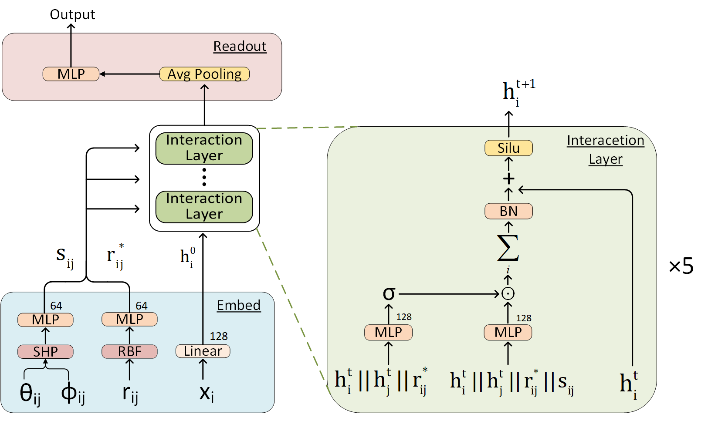
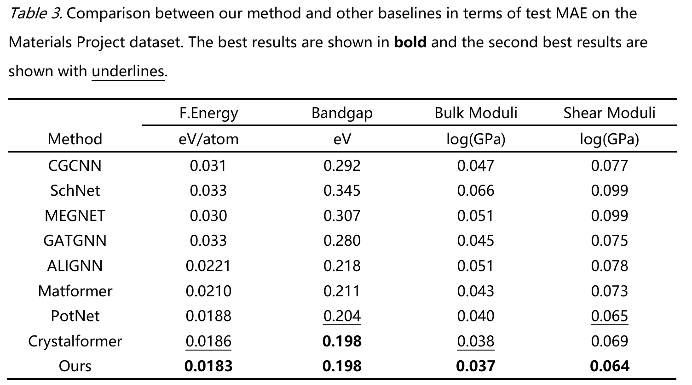
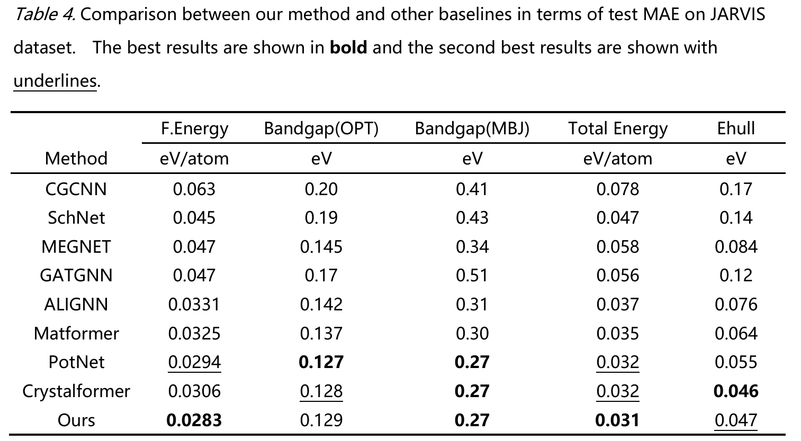
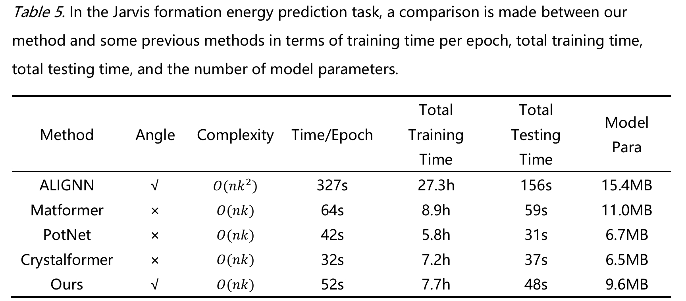

# SFTGNN
Official code repository of paper "SFTGNN: An Efficient Spherical Fourier Transform-Enhanced Graph Neural Network for High-Accuracy Crystal Property Prediction" by Zhen Jiang and Hua Tian.

<br><br>
<br><br>
### Benchmarked results
- **The Material Project Dataset**
<br><br>
- **Jarvis Dataset**
<br><br>
- **Efficiency**
<br><br>
## Environment Setup

We use **conda** to manage dependencies and set up the runtime environment. The recommended versions are:

- **Python**: 3.11.8  
- **PyTorch**: 2.2.2  
- **CUDA**: 12.1  

### 1. Create and activate a conda environment

```bash
conda create --name sftgnn python=3.11.8
conda activate sftgnn
```
### 2. Install PyTorch and CUDA dependencies

```bash
conda install pytorch=2.2.2 torchvision=0.17.2 torchaudio=2.2.2 pytorch-cuda=12.1 -c pytorch -c nvidia
```
### 3.Install PyTorch Geometric and related packages
We use PyTorch Geometric for implementing our graph neural network. Install it and related components using the following commands:
```bash
pip install torch_geometric==2.5.2
pip install torch-cluster==1.6.3 torch-scatter==2.1.2 torch-sparse==0.6.18 torch-spline-conv==1.2.2 \
  -f https://data.pyg.org/whl/torch-2.2.2%2Bcu121.html
```
### 4. Install additional dependencies
After completing the core setup, install other required packages via:
```bash
pip install -r requirements.txt
```

Once the required running environment for the model is created, training or testing can begin

## I. Training Modes

### 1. Command Line Training

The traditional command - line approach offers a straightforward and rapid way to initiate training. It is especially suitable for users who are familiar with terminal operations and prefer a concise way to start the training process.

To commence training in the terminal, use the following command:

```bash
python run.py --task train_and_test --target All
```

For the `target` parameter, using the option `All` enables the training of all tasks on two datasets simultaneously. You can also specify a single specific task. For example:

```bash
python run.py --task train_and_test --target Jarvis-FormationEnergy
```

To view other supported command line parameters and obtain more detailed help information, execute the following command:

```bash
python run.py --help
```

### 2. IDE - Based Training

#### Operation Steps

1. Open the `train_and_test.py` script in your IDE.

2. Locate the `if __name__ == "__main__":`**&#x20;entry code block** (this block only executes when the script is run directly, not when imported as a module).

3. Write or modify code within this block to configure training:

* Example: Specify the target task, adjust hyperparameters (e.g., learning rate, batch size).

* The script includes pre-provided code examples and comments to guide configuration.

```python
if __name__ == '__main__':
    data_config.batch_size = 32
    data_config.atom_features = AtomFeatureType.CrysAtomVec
    model_config.message = "SFTGNN Standard Model"
    model_config.lr = 1e-3
    model_config.max_lr = 1e-3

    targets = [*JarvisTarget, *MPTarget]  #All tasks for training both datasets
    for t in targets:
        data_config.target = t
        with TrainConfigManager(t):
            train_and_test()
```
## II. Resume Training

To avoid losing progress due to unexpected interruptions (e.g., power failure, network issues), the model automatically saves a checkpoint every 50 epochs.

### Important Note

This resume function **only works for single training tasks** (i.e., when `--target` is set to a specific task like `Jarvis-FormationEnergy`, not `All`). Resuming training for multiple tasks (via `--target All`) is not supported.

### Resume Steps


1. Identify the last saved checkpoint epoch (check the `./checkpoints` directory for files named with epoch numbers, e.g., `model_epoch_100.pth` indicates the last checkpoint was at epoch 100).

2. Resume training via one of the following methods:

* **Command Line Mode**: Add the `--begin_epoch` parameter to specify the resume epoch:


```bash
python run.py --task train\_and\_test --target Jarvis-FormationEnergy --begin\_epoch 100
```

* **IDE Mode**: Modify the `model_config.begin_epoch` value in the `if __name__ == "__main__":` entry code block of `train_and_test.py` to the last checkpoint epoch:

```python
if __name__ == '__main__':
    model_config.message = "SFTGNN Standard Model, Resume Training"
    model_config.begin_epoch = 350

    targets = [JarvisTarget.FormationEnergy]
    for t in targets:
        data_config.target = t
        with TrainConfigManager(t):
            train_and_test()
```

1. Run the training script again—the model will load the latest checkpoint and continue training from the specified epoch.

## III. Using Pretrained Models

We provide pretrained model weights for quick testing and deployment.

### 1. Download Pretrained Models

Access the Google Drive link to download pretrained models:
<https://drive.google.com/drive/folders/1aQ_7_LQo8D7GYlaoX518TRUhim0MRTgE?usp=sharing>

### 2. Place Model Weights

Create a `./parameter` directory in the root folder of the project (if it does not exist), and move all downloaded `.pth` files into this directory.

### 3. Run Testing with Pretrained Models

Choose one of the following methods to start testing:

#### Method 1: Command-Line Mode

Execute the following command in the terminal to test all tasks with pretrained models:

```bash
python run.py --task test --target All
```

To test a single task, replace `All` with the specific task name (e.g., `--target Jarvis-FormationEnergy`).

#### Method 2: IDE Mode

Open `train_and_test.py` and modify the code in the `if __name__ == "__main__":` entry code block—replace the `train_and_test()` function call with `test_with_pretrained_model()`:

Run the script directly in the IDE to start testing.
